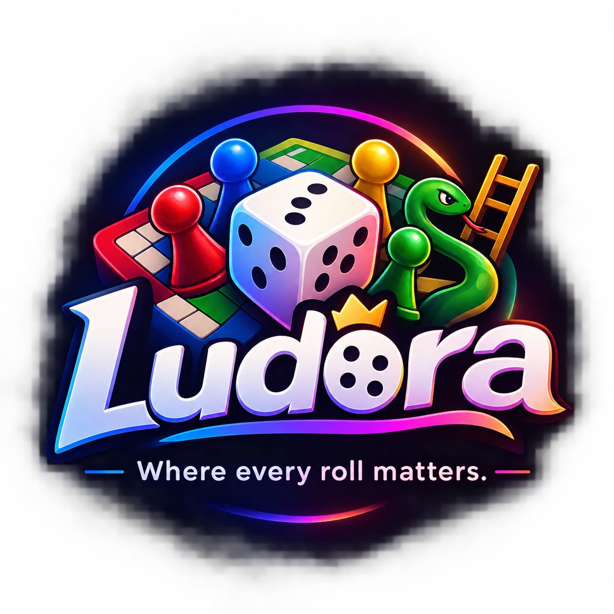
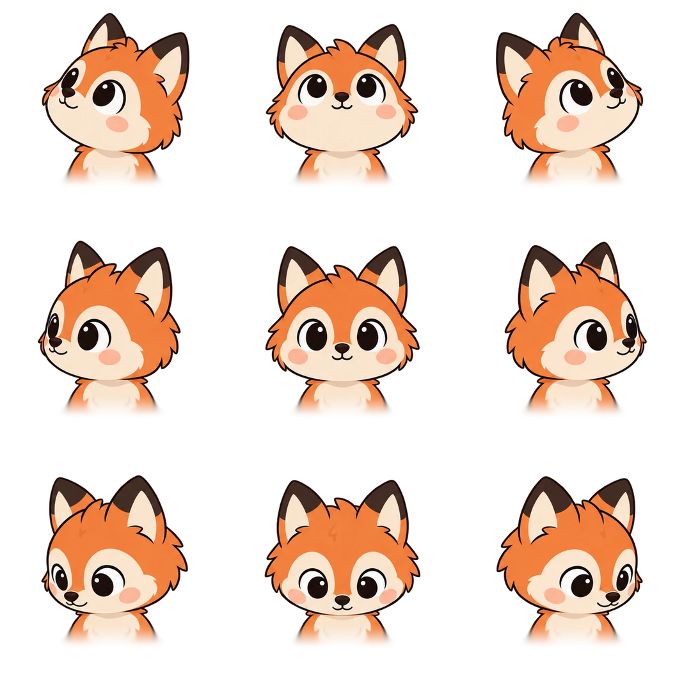
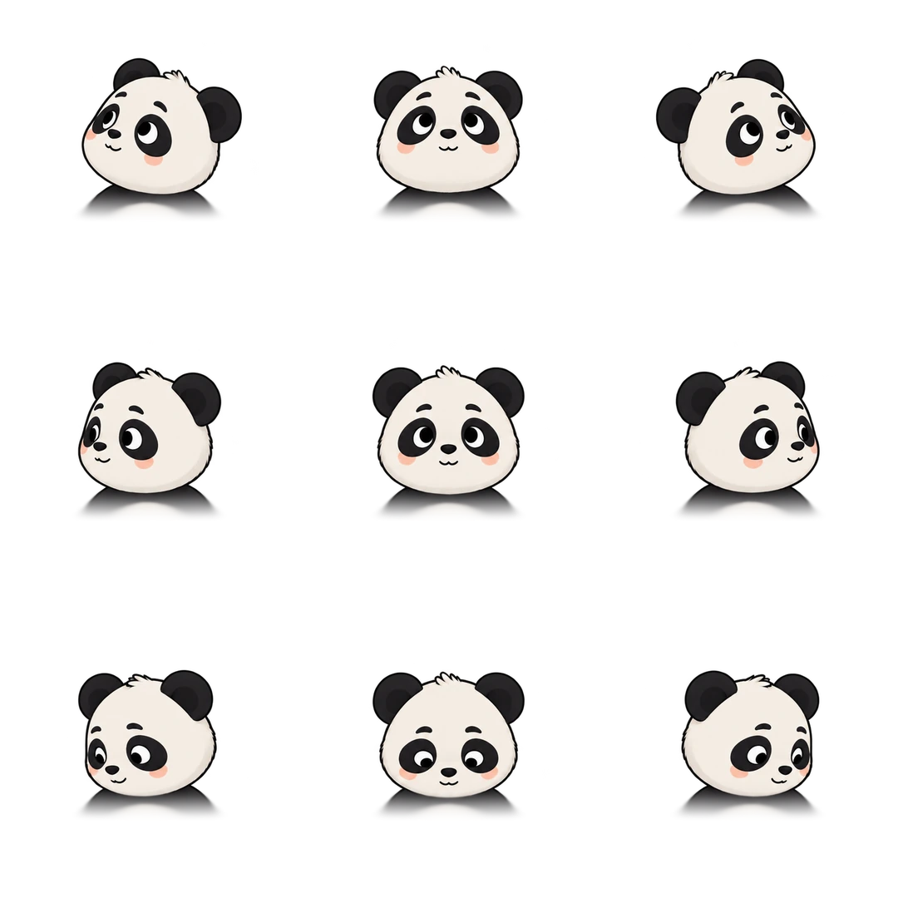
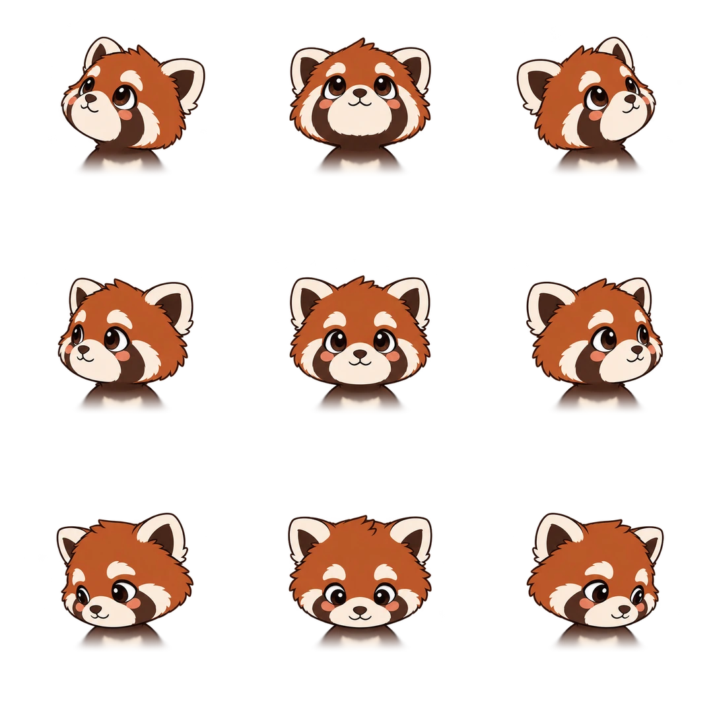
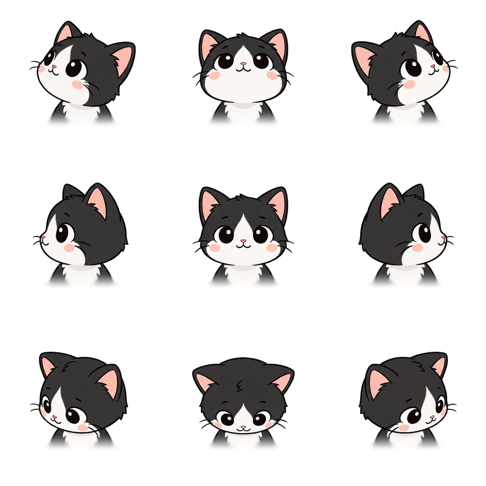
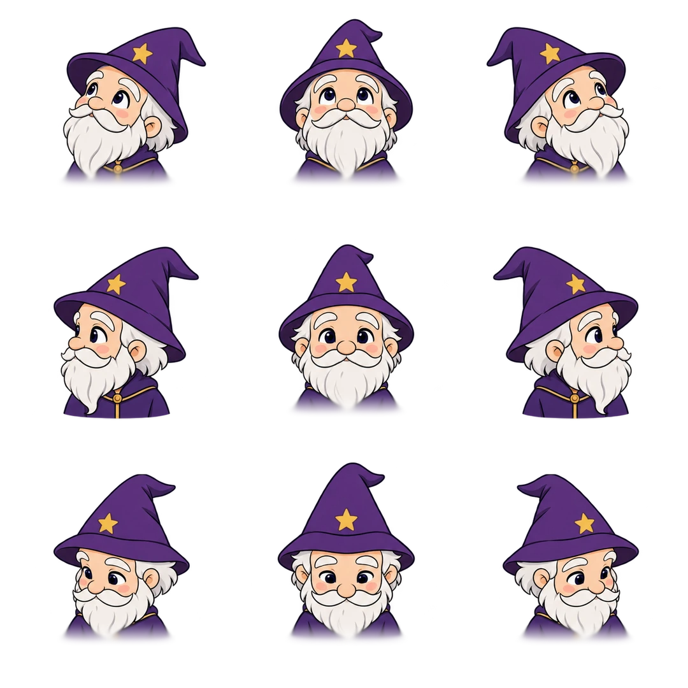
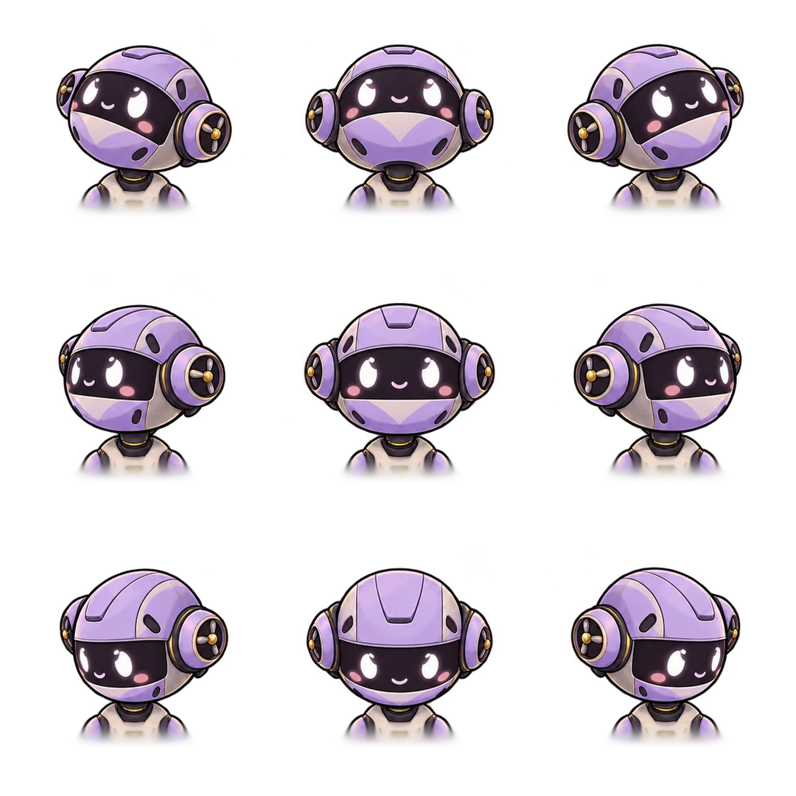
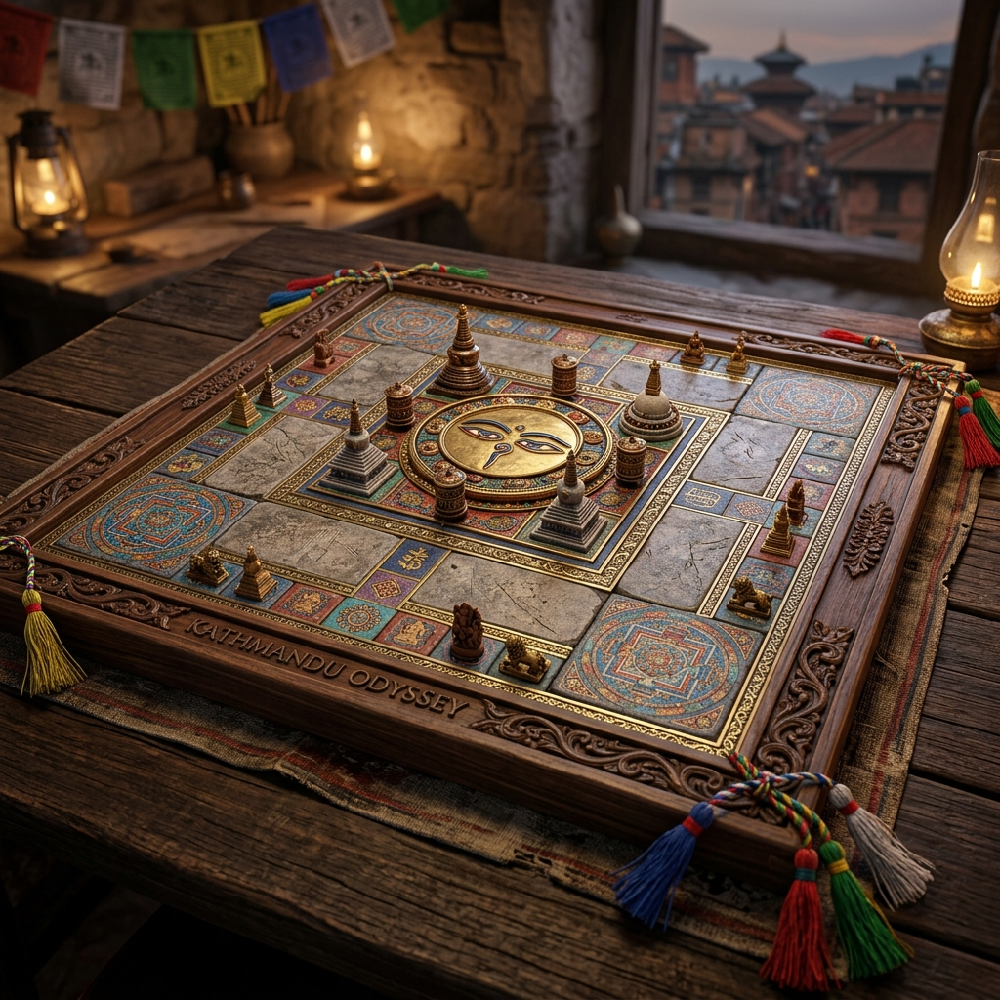
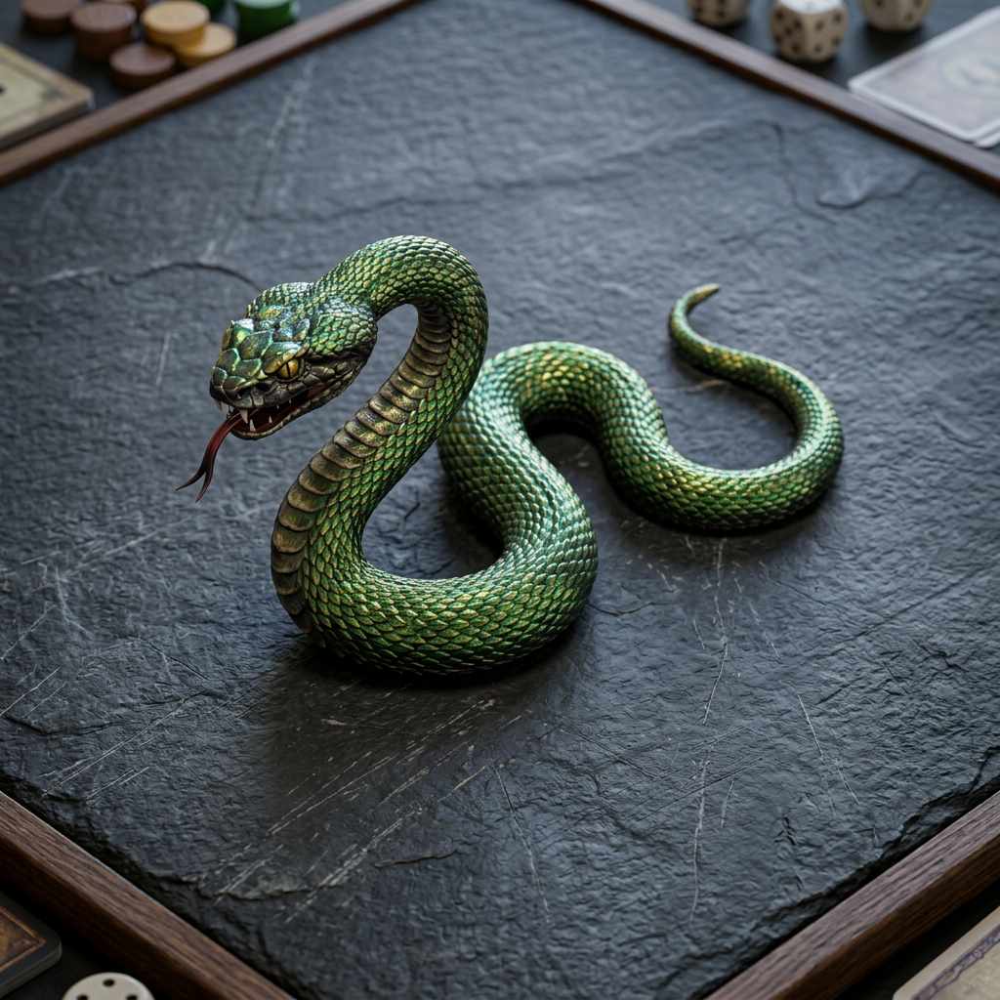

# Ludora

<p align="center">
  
</p>

<p align="center">
  <strong>Where every roll matters.</strong><br>
  Offline-first mobile board game platform featuring procedural 3D physics dice, authentic cultural boards, 56 interactive mascots, and deterministic game engines.
</p>

---

## Strategic Foundation: Why, Where, When, What

### 1. Why Ludora?
* **Why Offline-First?**
  Most mobile board games require persistent internet connections to serve invasive ads, crashing or freezing when network connectivity drops during commutes, flights, or rural travel. Ludora guarantees that 100% of game modes, heuristic AI opponents, local pass-and-play matches, and profile progression execute locally without making a single network call.
* **Why the Kathmandu Cultural Theme?**
  Mainstream Ludo implementations use flat, generic primary colors. Ludora grounds its aesthetic in the artisanal craftsmanship of the Kathmandu Valley: hand-carved dark walnut wood, gilded brass inlays, the four historical Durbar courtyards (Patan, Bhaktapur, Basantapur, Kirtipur), and Buddhist heritage (Swayambhunath Wisdom Eyes medallion, prayer flags).
* **Why Lightweight Procedural 3D Instead of Heavy Game Engines?**
  Heavy engines (such as Unity or Unreal) inflate download sizes to 200MB+ and drain mobile batteries. Ludora uses procedural canvas geometry, quaternion rotation matrices, and parametric Bézier curves directly in Android Jetpack Compose and HTML5 Canvas. The total binary stays lightweight while achieving a consistent 60 FPS.
* **Why Player-Respecting Monetization?**
  No mid-game ad interruptions, no pay-to-win mechanics, and zero ads during offline play. AdMob interstitial ads are gated by strict session caps, cooldown intervals, and age-assurance compliance.

---

### 2. Where Does Everything Live?
* **Deterministic Core Game Engines:** [`engine/ludo/`](file:///d:/ludo/engine/ludo/), [`engine/snake/`](file:///d:/ludo/engine/snake/), and [`engine/remix/`](file:///d:/ludo/engine/remix/) maintain pure state machines isolated from Android UI frameworks for reproducible gameplay and automated testing.
* **Offline Persistence:** [`core/database/`](file:///d:/ludo/core/database/) contains Room database entities, DAOs, and DataStore preferences for profiles, offline stats, and quest histories.
* **Visual Design System & Mascots:** [`core/designsystem/`](file:///d:/ludo/core/designsystem/) stores theme tokens, typography scales, 3D dice physics renderers, and all 56 animated mascot spritesheets.
* **Monetization & Ad Gateway:** [`core/common/ads/`](file:///d:/ludo/core/common/src/main/kotlin/game/ludora/core/common/ads/) defines policy managers and billing contracts; [`app/src/main/kotlin/game/ludora/ads/`](file:///d:/ludo/app/src/main/kotlin/game/ludora/ads/) houses production AdMob providers and Compose views.
* **Server-Authoritative Online Multiplayer:** [`core/network/`](file:///d:/ludo/core/network/) manages WebSocket protocol frames, room discovery, and matchmaking queues.

---

### 3. When Do Events Trigger?
* **Token Release:** Triggered strictly when a player rolls a value of `6` from a home yard slot.
* **Captures & Extra Rolls:** Triggered when a token lands on an opponent's cell on an open track. The captured piece returns to its starting courtyard, and the capturing player immediately earns a bonus roll.
* **Safe Cell Protection:** Triggered when landing on any of the 8 golden mandala stars. Tokens on safe cells cannot be captured.
* **Post-Match Interstitials:** Triggered strictly at the match conclusion boundary. Interstitials are suppressed if:
  1. The user purchased the "Remove Ads" pass (`isAdFree == true`).
  2. The device is offline (`isOnline == false`).
  3. Fewer than 8 minutes have passed since the previous interstitial.
  4. The user has played fewer than 2 matches since the previous ad.
  5. The user is in their first 3 initial game sessions.
* **Snake Swallowing:** Triggered in Snake & Ladder mode when a token lands on a snake head cell. The token traverses the parametric Bézier curve inside a peristaltic bulge envelope to the tail cell.

---

## 56 Interactive Page-Mascots

Ludora features an interactive companion mascot system. Equipped mascots sit on the player's dashboard and during match setup, dynamically tracking pointer/touch positions and reacting to game events.

<p align="center">
  
  
  
  
  
  
</p>

### Mascot Technical Specifications
* **Spritesheet Architecture:**
  Each mascot utilizes two aligned WebP spritesheets:
  1. `*-directions.webp`: 8 discrete gaze vectors (North, North-East, East, South-East, South, South-West, West, North-West) calculated in real time using $\theta = \text{atan2}(\Delta y, \Delta x)$.
  2. `*-reactions.webp`: 8 emotional state frames (happy bounce on a roll of 6, squint blink on opponent capture, celebration dance on match win, and sleeping idle during prolonged inactivity).
* **Catalog Categories ([`MascotData.kt`](file:///d:/ludo/core/designsystem/src/main/kotlin/game/ludora/core/designsystem/mascot/MascotData.kt)):**
  * **Animals (20):** Bear, Bunny, Cat, Deer, Dino, Fox, Frog, Hamster, Hedgehog, Koala, Otter, Owl, Panda, Penguin, Pug, Raccoon, Red Panda, Sheep, Sloth, Tiger.
  * **People (18):** Afro, Astronaut, Bald, Ballerina, Beard, Builder, Cap, Chef, Glasses, Grandpa, Granny, Hijabi, Nurse, Pirate, Scientist, Sikh, Skater, Wizard.
  * **Robots & Things (13):** Clockwork, CRT Monitor, Cube, Drone, Gearbot, Lantern, Postbot, Radio, Rocket, Toaster, TV.
  * **Special Styles (5):** Fox Ink, Fox Paper, Fox Pixel, Fox Riso, Fox Sketch.

---

## Visual Highlights & 3D Interactive Assets

### 1. Realistic 3D Isometric Tumbling Dice
The 3D dice engine renders a perspective-shaded isometric cube with dynamic tumble animations.

<p align="center">
  
</p>

* **Implementation:** [`Realistic3DDiceRenderer.kt`](file:///d:/ludo/core/designsystem/src/main/kotlin/game/ludora/core/designsystem/dice/Realistic3DDiceRenderer.kt) and [`preview/app.js`](file:///d:/ludo/preview/app.js)
* **Top-Face Alignment Math:**
  When rolling stops on face value $V \in [1..6]$, the renderer applies the orientation matrix $M = R_{\text{cam}} \cdot R_{\text{face}}(V)$. This guarantees that the face normal of value $V$ points toward $(0.0, \sqrt{2/3}, 1/\sqrt{3})$—the topmost visible facet in isometric space ($Y > 0.7$, $Z > 0.3$).

---

### 2. Authentic 15×15 Kathmandu Cultural Board
A regulation $15 \times 15$ Ludo board based on traditional Newari wood carving and Durbar Square architecture.

<p align="center">
  
</p>

* **Implementation:** [`preview/app.js`](file:///d:/ludo/preview/app.js) and [`app.js`](file:///d:/ludo/app.js)
* **4 Corner Courtyards ($6 \times 6$ cells each):**
  * **Patan Chowk** (Top-Left, Crimson Red `#9E2A1A`)
  * **Bhaktapur** (Top-Right, Forest Green `#0E5C38`)
  * **Basantapur** (Bottom-Right, Mustard Gold `#A6730A`)
  * **Kirtipur** (Bottom-Left, Royal Blue `#154182`)
  * Each courtyard includes an inner raised pedestal, gold inlay borders, palace labels, and 4 token slots.
* **72 Track Cells:** Alternating dark walnut wood tiles with brass borders and color-coded home path chevrons.
* **8 Sacred Safe Squares:** Embellished with 8-pointed golden Nepali mandala stars at coordinates `(1, 6)`, `(6, 2)`, `(8, 1)`, `(12, 6)`, `(13, 8)`, `(8, 12)`, `(6, 13)`, and `(2, 8)`.
* **Central Victory Goal ($3 \times 3$ cells):** 4 home triangles capped by a gilded medallion with 16 sculpted lotus petals, Swayambhunath Wisdom Eyes, the sacred unity curl (*Ek*), and the wisdom *Urna*.

---

### 3. Realistic 3D Peristaltic Snake
A procedural snake model for Snake & Ladder mode.

<p align="center">
  
</p>

* **Implementation:** [`preview/app.js`](file:///d:/ludo/preview/app.js)
* **Mechanics:** Cubic Bézier spine formulation with continuous curvature, real-time sine envelope swallow bulges, emerald and gold metallic scales, and dynamic tongue flick animations.

---

## Core Game Engines & Rules

### 1. Classic Ludo
* **Board Dimensions:** $15 \times 15$ tournament grid ($225$ total cell positions).
* **Track Length:** $52$ common track steps plus $5$ colored home path steps per player.
* **Rules:**
  * Release a token from the yard on rolling a `6`.
  * Rolling a `6` awards a bonus turn (capped at 3 consecutive sixes to prevent infinite turn abuse).
  * Landing on an opponent's token sends it back to its courtyard yard.
  * Tokens resting on the 8 golden mandala safe stars cannot be captured.
  * Entry into the home column requires exact dice roll steps.

### 2. Snake & Ladder
* **Board Dimensions:** $10 \times 10$ boustrophedon track ($100$ cells).
* **Mechanics:** Ladders offer upward shortcuts; snakes pull players down to their tail coordinates with animated peristaltic swallow sequences.

### 3. Ludora Remix
* **Tactical Modifiers:** Hybrid mode adding dynamic hazard tiles (ice slides, trap doors, portal skips) and single-use power cards to classic Ludo tracks.

---

## Monetization & AdMob Integration

Ludora balances developer sustainability with a non-intrusive player experience:
* **Google Mobile Ads Integration:** Declared in [`AndroidManifest.xml`](file:///d:/ludo/app/src/main/AndroidManifest.xml) and injected securely via Gradle build properties.
* **Ad Formats Supported:**
  * **Banner (`Ludo_Banner`):** Displayed at the bottom of the home dashboard and menus.
  * **Interstitial (`Ludo_Match_Over`):** Displayed strictly between matches after game completion.
  * **Rewarded (`Ludo_Extra_Roll`):** Optional opt-in video granting bonus coins, quest rerolls, or cosmetic spins.
* **Development Safety:** Debug builds automatically route through Google's official test ad unit IDs in [`app/build.gradle.kts`](file:///d:/ludo/app/build.gradle.kts) to protect against policy strikes or account suspensions during testing.
* **Architecture:**
  * [`AdMobProvider.kt`](file:///d:/ludo/app/src/main/kotlin/game/ludora/ads/AdMobProvider.kt): Production provider handling background preloading and full-screen callbacks.
  * [`AdBannerView.kt`](file:///d:/ludo/app/src/main/kotlin/game/ludora/ads/AdBannerView.kt): Compose wrapper for bottom banners.
  * [`AdPolicyManager.kt`](file:///d:/ludo/core/common/src/main/kotlin/game/ludora/core/common/ads/AdPolicyManager.kt): Strict policy enforcement (frequency cooldowns and session grace periods).
  * [`BillingService.kt`](file:///d:/ludo/core/common/src/main/kotlin/game/ludora/core/common/ads/BillingService.kt): In-app purchase contract for the "Remove Ads" pass.

---

## Audio & Haptics

* **Himalayan Singing Bowl Synthesizer:** Modal physical synthesis using resonant bandpass filters tuned to traditional singing bowl harmonics ($216\text{ Hz}$, $432\text{ Hz}$, $864\text{ Hz}$, $1296\text{ Hz}$).
* **Tactile Haptic Engine:** Configurable vibration patterns for dice rolls, token captures, safe square landings, and victories via [`HapticFeedbackManager.kt`](file:///d:/ludo/core/common/src/main/kotlin/game/ludora/core/common/feedback/HapticFeedbackManager.kt).

---

## Repository Architecture

```text
ludo/
├── app/                        # Android application entry point & UI
│   ├── src/main/AndroidManifest.xml
│   └── src/main/kotlin/game/ludora/
│       ├── LudoraApplication.kt# MobileAds & app initialization
│       ├── MainActivity.kt     # Jetpack Compose root & screen navigation
│       ├── ads/                # AdMobProvider & AdBannerView
│       └── ui/                 # Game screens, dashboards, dialogs
├── core/
│   ├── common/                 # Ad policies, billing, audio, and haptics
│   ├── designsystem/           # Theme, 3D dice renderer, mascots
│   ├── database/               # Room database & local profile storage
│   ├── model/                  # Domain state models, token rules, quests
│   └── network/                # Realtime multiplayer & matchmaking client
├── engine/
│   ├── core/                   # Shared deterministic board logic
│   ├── ludo/                   # Ludo engine, valid moves, win conditions
│   ├── snake/                  # Snake & Ladder engine
│   ├── ai/                     # Heuristic & Monte-Carlo AI opponents
│   └── remix/                  # Ludora Remix power card rules
├── assets/                     # 3D visual renders & mascot graphics
│   ├── mascots/                # Sample mascot previews (fox, panda, cat, etc.)
│   ├── kathmandu_mandala_board.jpg
│   ├── realistic_3d_dice.jpg
│   └── realistic_3d_snake.jpg
├── preview/                    # Web-based interactive testing studio
│   ├── index.html              # Interactive canvas studio & compliance hub
│   ├── styles.css              # Obsidian slate dark theme styling
│   └── app.js                  # 3D dice tumble, snake canvas, 15x15 board
└── docs/                       # Technical specifications (01 to 21)
```

---

## Web Preview Studio

The repository includes a live web preview studio for testing game math, animations, and policies:
* Open [`preview/index.html`](file:///d:/ludo/preview/index.html) in any browser.
* Features:
  * **3D Isometric Dice Studio:** Roll and inspect the top-face alignment for faces 1 through 6.
  * **Snake & Ladder Studio:** Test peristaltic token swallow animations.
  * **15×15 Kathmandu Board Studio:** Inspect the full cultural layout with 4 courtyards, 8 safe stars, and central medallion.
  * **Audio Vibe Engine:** Test the Himalayan singing bowl synthesizer.
  * **Compliance Hub:** 5-tab policy viewer (Privacy Policy, Terms of Service, Children's Privacy/COPPA, IAP & Refunds, Security & Fair Play) with live clause search.

---

## License & Compliance

* Built in compliance with Google Play Families Policy and COPPA standards.
* Advertising is protected by parental consent flags, age assurance gates, and server-side reward verification.
